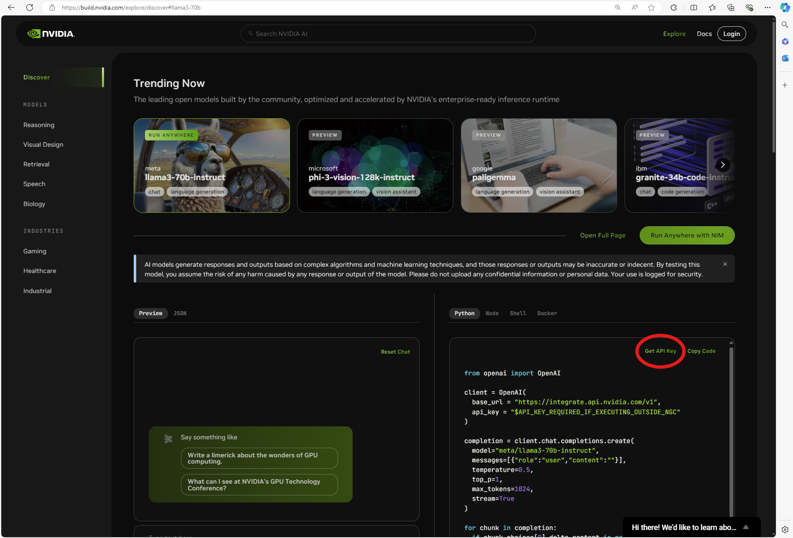

# Metropolis NIM Workflows 

This repository hosts reference worfklows that show how to build applications using NVIDIA Inference Microservices (NIMs)

The workflows in this repository will require an API key for accessing NIMs. This API Key can be generated at [build.nvidia.com](https://build.nvidia.com). The API Key is used to authorize requests sent to the NIMs and allows access to variety of AI models such as LLMs, VLMs and CV models. 

## Getting Started 

### 1. Clone Repository 

Clone repo 
```
git clone https://github.com/NVIDIA/metropolis-nim-workflows
```

### 2. Generate API Key 

Go to [build.nvidia.com](https://build.nvidia.com) and create an account. Each new account can receive up to 5000 free credits. One request to a NIM uses one credit. 

After making an account, you can get an API Key by selecting any of the available NIMs then in the example code section, click on "Get API Key" then "Generate Key". 




You will then see your API Key that will look something like "nvapi-xxx-xxxxxxxx_xxxxxxxxxxxxxxxx_xxxxxxxxxxx-xxxxxxx-xxxxxxxxxxxxxx". This full key is what will be used in the example notebooks and scripts. 

### 3. Python Setup 

Ensure you have Python3.10 or above installed on your system. Refer to the [Python documentation](https://www.python.org/downloads/) for download and installation intructions. 


### 4. NIM Workflows 

You can now continue and explore the NIM workflows: 

- [VLM Alert System](workflows/vlm_alerts/README.md)

