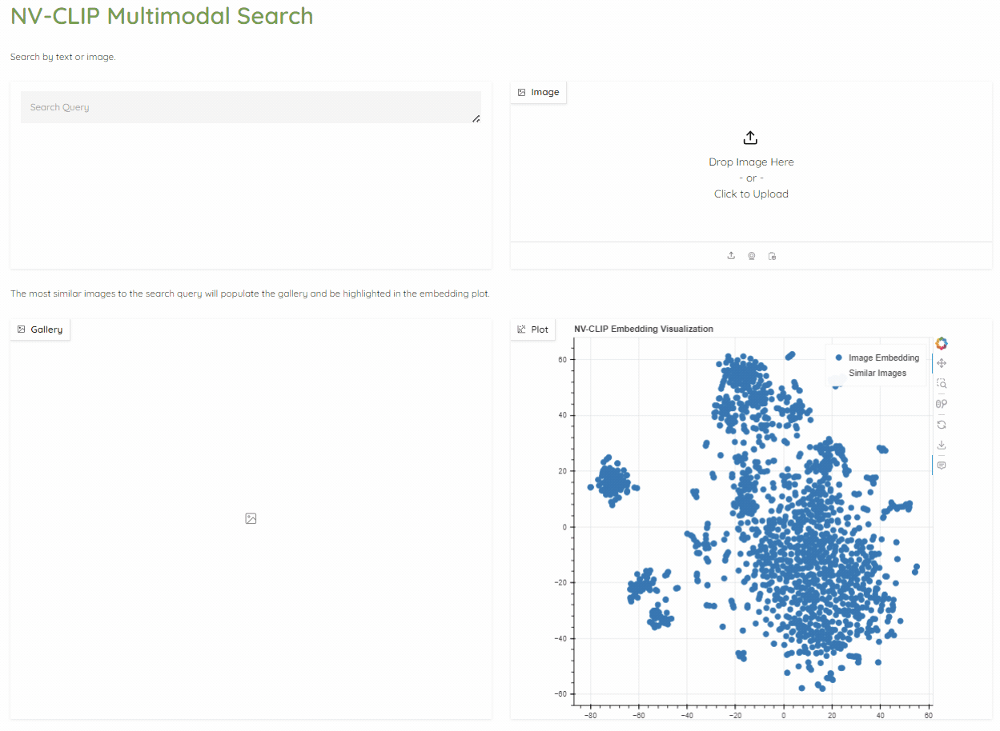
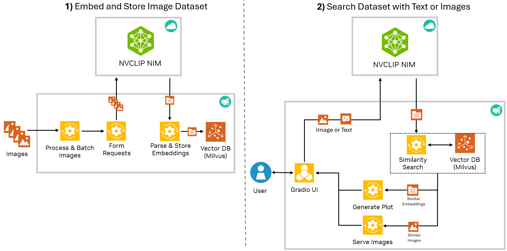
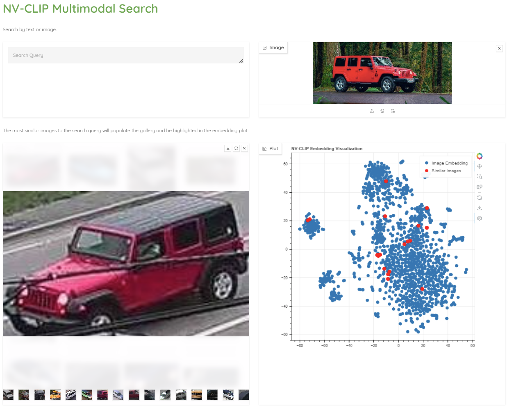

# NV-CLIP Multimodal Search with NIMs



## Introduction

This example shows how to use the NV-CLIP NIM to and combine it with a vector database to rapidly search a collection of images using text and image prompts. 

The Jupyter notebook workshop walks through how to build this demo for a traffic vehicle search use case. The Gradio UI is also available as a standalone application that can be used with any folder of images. This is all possible with the NV-CLIP NIM API, allowing the notebook and Gradio Demo to run on nearly any computer. No GPU required!



## Setup

**Note**: The notebook and demo for this example will not run directly on Windows due to [lack of Windows support with Milvus-Lite](https://github.com/milvus-io/milvus/issues/34854). If you are on Windows, please use WSL to run the notebook and demo. Mac and Linux are supported. 

### Clone repository
```
git clone https://github.com/NVIDIA/metropolis-nim-workflows
cd metropolis-nim-workflows/nim_workflows/nvclip_multimodal_search
```

### Make and activate virtual environment (Optional)

It is recommended to setup a virtual environment to install the Python dependencies. For more resources on creating a virtual environment refer to the [Python documentation](https://docs.python.org/3/tutorial/venv.html). 

```
python3 -m venv venv 
source venv/bin/activate
```

Install dependencies
```
python3 -m pip install -r requirements.txt
```

## Workshop Notebook (Optional) 

If you would like to go through a tutorial of how to use NV-CLIP, then you can launch the workshop notebook. This will walk you through how to use NV-CLIP and build a multimodal search application for a traffic vehicle dataset. Otherwise, you can directly run the semantic search demo on any folder of images shown in the next section. 

Launch jupyter notebook
```
python3 -m notebook 
```

This will launch the jupyter notebook web interface. You can navigate to the ```nvclip_workshop.ipynb``` notebook in this repository to go through the tutorial. 

## Semantic Search Demo
The semantic search demo will use the NVCLIP NIM to generate embeddings for any given folder of images on your local computer. Then from the Gradio UI, you will be able to view a plot of the embeddings and search your images through text and image prompts. 





To launch the multimodal search demo on its own (without the notebook), you can run the main.py script directly and provide the necessary arguments: 

```
usage: main.py [-h] [--nvclip_url NVCLIP_URL] [--gradio_port GRADIO_PORT] image_folder api_key

NV-CLIP Multimodal Search

positional arguments:
  image_folder          Path to folder of images to embed and search over
  api_key               NVIDIA NIM API Key

options:
  -h, --help            show this help message and exit
  --nvclip_url NVCLIP_URL
                        URL to NVCLIP NIM
  --gradio_port GRADIO_PORT
                        Port to run Gradio UI
```

Example Usage:

```
python3 main.py images/my_images nvapi-***
```

The only required arguments are a path to a folder of images and your NIM API key. Once launched, the script will use the NV-CLIP NIM to generate embeddings for each image in the provided folder and store the embeddings in a local Milvus vector database. Depending on how many images you have in your folder, this may take several minutes. Note that each request to NV-CLIP will use 1 credit and each NV-CLIP request can embed up to 64 images at a time. For example, a folder with 256 images will use 4 credits.

Once the script is launched, the Gradio UI will become available at ```http://localhost:7860```


