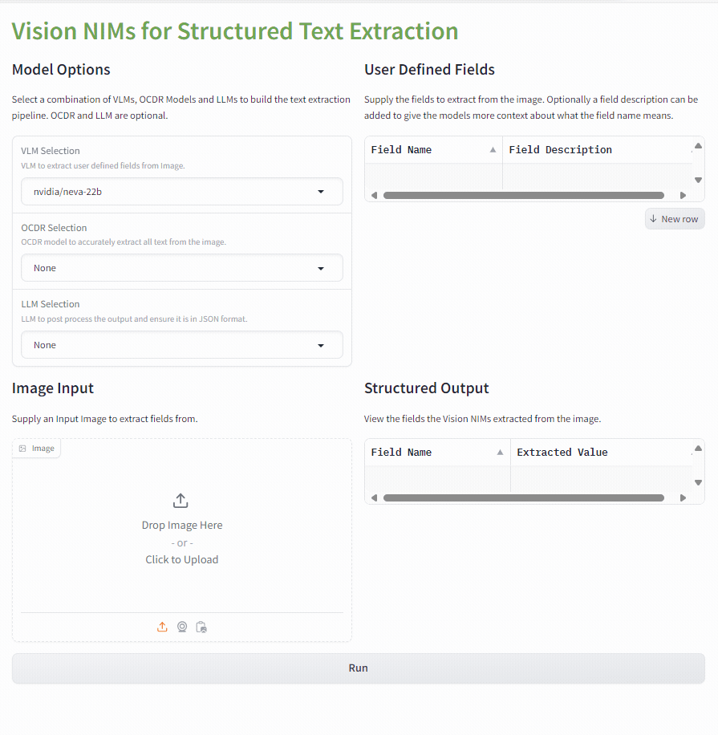
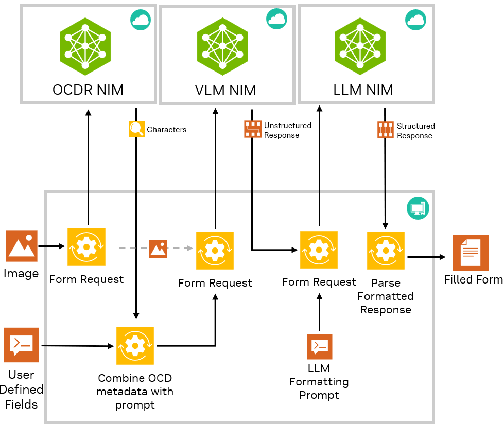
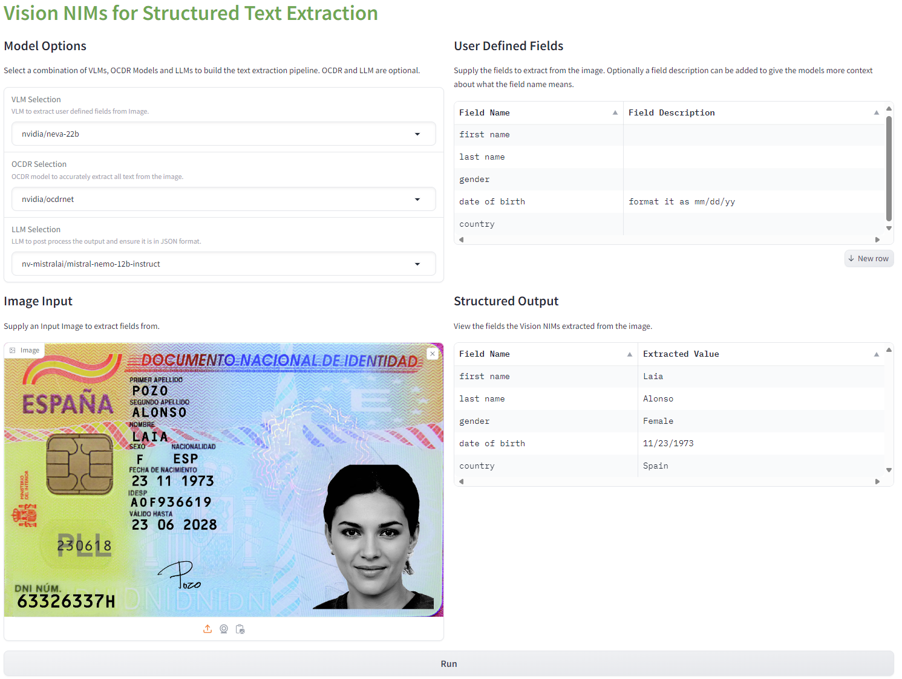

# Structured Text Extraction with NIMs



## Introduction

This example shows how to use Vision NIMs (VLMs, Florence, OCDRNet) and LLMs to create a robust pipeline for structured text extraction from images. 

It is often a challenge to extract specific pieces of information from documents such Photo IDs. With many different formats of Photo IDs and irregular placement of key information it can be difficult to use traditional CV models to robustly extract fields from the Photo ID such as First Name, Last Name, Date of Birth etc.

This workflow shows how to build a robust text extraction pipeline where the user can specify in natural language what fields to extract from a given image and receive the filled out fields in JSON format. This pipeline is not limited to working on just Photo IDs but can be applied to any type of input image or document where the user want's to extract key information in a structured format. The fields to extract are fully customizable and not hard coded for any specific use case.



## Setup 

### Clone repository

If you have not cloned the repository, then clone with git and change directory into the vision_text_extraction workflow folder. 

```
git clone https://github.com/NVIDIA/metropolis-nim-workflows
cd metropolis-nim-workflows/nim_workflows/vision_text_extraction
```

### Make and activate virtual environment (Optional)

It is recommened to setup a virtual environment to install the Python dependencies. Based on your OS, the commands are slightly different. For more resources on creating a virtual enviroment refer to the [Python documentation](https://docs.python.org/3/tutorial/venv.html). 

**Mac & Linux**
```
python3 -m venv venv 
source venv/bin/activate
```

**Windows**
```
python3 -m venv venv 
.\venv\Scripts\activate.bat
```


### Install dependencies

```
python3 -m pip install -r requirements.txt
```

## Vision NIM for Structured Text Extraction Workshop Notebook (Optional) 

If you would like to go through a tutorial showing how to chain together Vision NIMs to build this pipeline, then launch the workshop notebook. Otherwise, you can directly run the Gradio demo shown in the next section. 

Launch notebook
```
python3 -m notebook 
```

This will launch the jupyter notebook web interface. You can navigate to the ```structured_text_extraction.ipynb``` notebook in this repository to go through the tutorial. 


## Gradio Demo for Structured Text Extraction
To launch the Gradio demo on its own (without the notebook), you can run the main.py directly and provide your API Key. Your API key should come from [build.nvidia.com](http://build.nvidia.com).
```
usage: main.py [-h] [--gradio_port GRADIO_PORT] api_key

Structured Text Extraction

positional arguments:
  api_key               NVIDIA NIM API Key

options:
  -h, --help            show this help message and exit
  --gradio_port GRADIO_PORT
                        Port to run Gradio UI
```

For example:

```
python3 main.py "nvapi-123"
```



Once it is launched, you can access the Gradio UI at http://localhost:7860

From the UI, you will be able to configure the VLM, OCDR model and LLM model used to build the structured text extraction pipeline as well as define any custom fields to extract from input images. The outputs will be presented in a tabular format. 