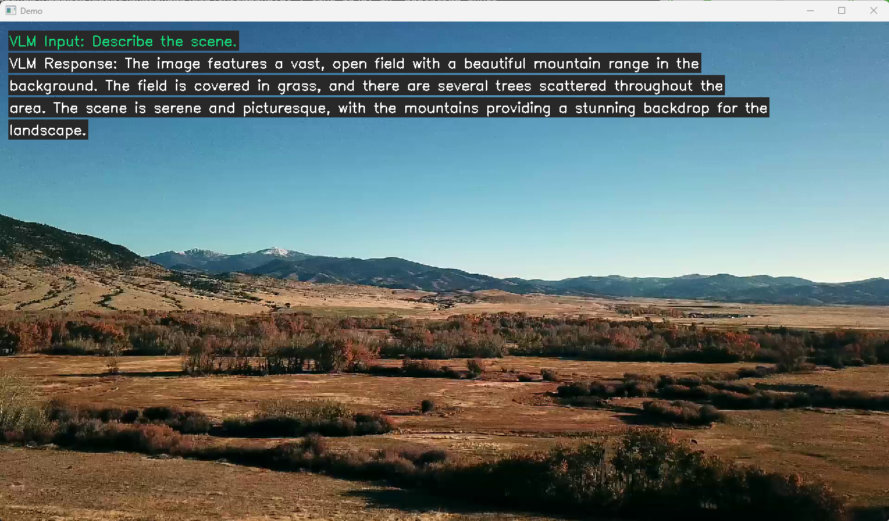
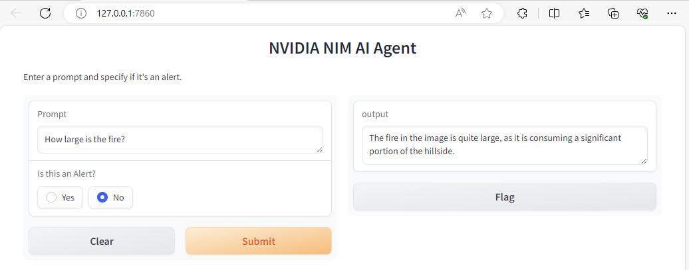
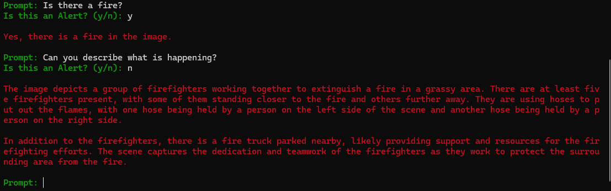

# VLM Video Alerts with NIMs


## Introduction

This example shows how to use a Visual Language Model NIM combined with streaming video to build an application that allows you to chat with a video and set looping prompts for alert use cases. 

For example, the VLM NIM can be set to monitor video input of drone footage that contains sections of a wildfire. A continuous prompt can then be set asking the VLM "Is there a fire?" on the video input. The VLM will then watch for a fire in the video stream and can send a notification to the user when it detects a fire. This detection could then be connected with another script to take some action such as sending a push notification to a mobile app. This example could also be extended to build a more complex VLM agent capable of detecting many alerts across several live video streams using NIMs. 


## Setup 

### Clone repository

If you have not cloned the repository, then clone with git and change directory into the vlm_alerts workflow folder. 

```
git clone https://github.com/NVIDIA/metropolis-nim-workflows
cd metropolis-nim-workflows/nim_workflows/vlm_alerts
```

### Make and activate virtual environment (Optional)

It is recommened to setup a virtual environment to install the Python dependencies. Based on your OS, the commands are slightly different. For more resources on creating a virtual enviroment refer to the [Python documentation](https://docs.python.org/3/tutorial/venv.html). 

**Mac & Linux**
```
python3 -m venv venv 
source venv/bin/activate
```

**Windows**
```
python3 -m venv venv 
.\venv\Scripts\activate.bat
```


### Install dependencies

```
python3 -m pip install -r requirements.txt
```

## VLM Workshop Notebook (Optional) 

If you would like to go through a tutorial of how to use VLM NIMs, then launch the workshop notebook. Otherwise, you can directly run the streaming pipeline shown in the next section. 

Launch notebook
```
python3 -m notebook 
```

This will launch the jupyter notebook web interface. You can navigate to the ```vlm_nim_workshop.ipynb``` notebook in this repository to go through the tutorial. 


## Streaming Pipeline
To launch the streaming pipeline on its own (without the notebook), you can run the main.py directly and provide the necessary arguments:

```
usage: main.py [-h] --model_url MODEL_URL --video_file VIDEO_FILE --api_key API_KEY [--port PORT] [--websocket_port WEBSOCKET_PORT] [--overlay] [--loop_video] [--hide_query]

Streaming pipeline for VLM alerts.

options:
  -h, --help            show this help message and exit
  --model_url MODEL_URL
                        URL to VLM NIM
  --video_file VIDEO_FILE
                        Local path to input video file or RTSP stream
  --api_key API_KEY     NIM API Key
  --port PORT           Flask port
  --websocket_port WEBSOCKET_PORT
                        WebSocket server port
  --overlay             Enable VLM overlay window
  --loop_video          Continuosly loop the video
  --hide_query          Hide query output from overlay to only show alert output
```

For example 

```
python3 main.py --model https://ai.api.nvidia.com/v1/vlm/nvidia/neva-22b --video_file test_video.mp4 --api_key "nvapi-123" --overlay --loop_video
```




All VLM nims are supported. The following list can be used in the --model_url argument of main.py 

- https://ai.api.nvidia.com/v1/gr/meta/llama-3.2-90b-vision-instruct
- https://ai.api.nvidia.com/v1/gr/meta/llama-3.2-11b-vision-instruct
- https://ai.api.nvidia.com/v1/vlm/nvidia/vila
- https://ai.api.nvidia.com/v1/vlm/nvidia/neva-22b
- https://ai.api.nvidia.com/v1/vlm/microsoft/kosmos-2
- https://ai.api.nvidia.com/v1/vlm/adept/fuyu-8b
- https://ai.api.nvidia.com/v1/vlm/google/paligemma
- https://ai.api.nvidia.com/v1/vlm/microsoft/phi-3-vision-128k-instruct


Your api key should come from [build.nvidia.com](http://build.nvidia.com) 

Once it is launched, you should see a window pop up with the video playing and the REST API endpoint should be live to send prompt updates.

### RTSP Input (Experimental)

The --video_file parameter is passed to the [OpenCV VideoCapture function](https://docs.opencv.org/4.x/d8/dfe/classcv_1_1VideoCapture.html) which supports both video files and RTSP streams. This means you can directly pass an RTSP stream link to the --video_file argument. For example:

```
python3 main.py --model https://ai.api.nvidia.com/v1/vlm/nvidia/neva-22b --video_file "rtsp://0.0.0.0:8554/stream" --api_key "nvapi-123" --overlay --loop_video
```

The pipeline will then pull the frames from the RTSP stream to use as input. Support for RTSP streaming depends on your OS and installed media backends supported by OpenCV such as FFMPEG and GStreamer. If you have issues with RTSP streaming, please refer to the [OpenCV documentation](https://docs.opencv.org/4.x/d8/dfe/classcv_1_1VideoCapture.html#a31e7cf5ba9debaec15437a200b18241e). 

## Streaming Pipeline Client
Once the main script is launched, the streaming pipeline can be interacted with through the query REST API endpoint as shown in the jupyter notebook with these Python code snippets.  

```
#send query 
prompt = "Can you describe the scene?"
params = {"query":prompt, "alert":False}
url = f"http://localhost:{port}/query"
response = requests.get(url, params=params)
print(response)
print(response.text)
```

```
#send alert. This will be evaluated continuously.  
prompt = "Is there a fire? Answer yes or no."
params = {"query":prompt, "alert":True} #set alert to True to enable continuous evaluation
url = f"http://localhost:{port}/query"
response = requests.get(url, params=params)
print(response)
print(response.text)
```

Or with cURL commands from another terminal:
```
curl --location 'http://0.0.0.0:5432/query?query=describe%20the%20scene&alert=False'
```

```
curl --location 'http://0.0.0.0:5432/query?query=Is%20there%20a%20fire%3F&alert=True'
```


You can call this endpoint from the jupyter notebook cells or by running one of the client programs 

- client_cli.py
- client_gradio.py  

```
python3 client_gradio.py
```




```
python3 client_cli.py
```



Both client programs will allow you to send queries and alerts to the running streaming pipeline. 

### Running Headless & Receiving Alerts 

In addition to the overlay generation, the VLM responses are also output on a websocket at port 5433 by default. 

If you run the pipeline without overlay generation by removing the --overlay flag, then you can still view and receive the VLM output on the websocket. 

```
python3 main.py --model https://ai.api.nvidia.com/v1/vlm/nvidia/neva-22b --video_file "video.mp4" --api_key "nvapi-123" --loop_video
```

The websocket output can be viewed by running the websocket_listener.py script. 

```
python3 websocket_listener.py "ws://localhost:5433"
```

The websocket output can be integrated with other scripts and services to take some action based on the VLM alert output. 

### Deploying and Running with a local VLM 

The VILA 35B downloadable NIM is now available. Once deployed, this workflow can run locally without calling the preview NIM APIs. 

#### Deploy VILA NIM (H100, A100 or L40S Required)

For full deployment documentation of the VILA NIM view [this page](https://docs.nvidia.com/nim/visual-language-models/vila/latest/getting-started.html). The quick steps have been listed below: 

Log into the NGC docker registry with your NGC API key. 
```
docker login nvcr.io 
```

Pull the VILA NIM container 
```
docker pull nvcr.io/nim/nvidia/vila-1.5-35b:1.0.0
```

Export your NGC API Key and a path to store the model weights. 
```
export NGC_API_KEY=abc123
export LOCAL_NIM_CACHE=~/.cache/nim
```

Run the VILA container. This will automatically launch the REST API endpoint for VILA to connect with this workflow. 
```
docker run -it --rm --name=vila \
  --runtime=nvidia \
  --gpus '"device=0"' \
  --shm-size=16GB \
  -e NGC_API_KEY=$NGC_API_KEY \
  -v "$LOCAL_NIM_CACHE:/opt/nim/.cache" \
  -u $(id -u) \
  -p 8000:8000 \
  nvcr.io/nim/nvidia/vila-1.5-35b:1.0.0
```

#### Run Workflow 

To run the workflow, the only difference is the --model_url parameter now needs to point to your local deployment instead of the preview API URL. Additionally the --model_name parameter needs to be added with 'nvidia/vila'. The --api_key can be any string as the local NIM does not require authentication. Everything else functions the same way. 

To run with overlay:
```
python3 main.py --model_url http://0.0.0.0:8000/v1/chat/completions --model_name nvidia/vila --video_file test_video.mp4 --api_key "nvapi-123" --overlay --loop_video
```

To run headless:
```
python3 main.py --model_url http://0.0.0.0:8000/v1/chat/completions --model_name nvidia/vila --video_file "/home/sochoa/Desktop/metropolis-nim-workflows/workflows/vlm_alerts/fire.mp4" --api_key "nvapi-123" --loop_video
```

Once deployed, you can send queries through the curl commands or one of the client scripts as shown in the above sections. 

