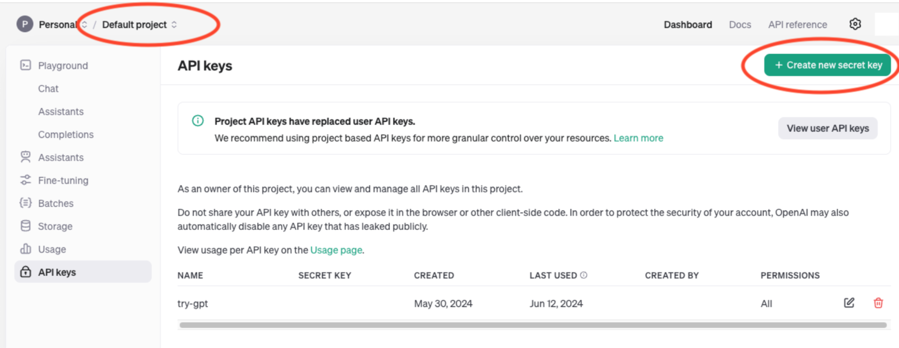

# Metropolis VIA Microservice Workflows

Each directory contains steps to get started with a reference workflow.

- [VIA Summarization Examples](summarization_examples/)
- [Agentic RAG with Morpheus, RIVA and VIA Microservices](video_agentic_rag_with_morpheus_riva/)


**VIA Microservice Architecture** 
<div align="center">
  
</div>

## Prerequisites

Follow the below steps to get the required API keys.

### 1. Clone the repository

```
git clone https://github.com/NVIDIA/metropolis-nim-workflows
```

### 2. Generate NVIDIA API Key

Log in to https://build.nvidia.com/explore/discover.

You can get an API Key by selecting any of the available NIMs (for example [https://build.nvidia.com/meta/llama3-70b](https://build.nvidia.com/meta/llama3-70b)). Then in the example code section, click on "Get API Key" then "Generate Key".

You will then see your API Key that will look something like "nvapi-xxx-xxxxxxxx_xxxxxxxxxxxxxxxx_xxxxxxxxxxx-xxxxxxx-xxxxxxxxxxxxxx".

<div align="center">
  
</div>

Store the generated API Key securely for future use.

### 3. OpenAI Key (for GPT-4o VLM)

- Login at: https://platform.openai.com/apps
- Select: API
- Create a new API key for your project at: https://platform.openai.com/api-keys
- Store the generated API Key securely for future use.

<div align="center">
  
</div>

### 4. NGC Key (for VITA 2.0 VLM)

Follow the steps in [https://docs.nvidia.com/ngc/gpu-cloud/ngc-user-guide/index.html#generating-api-key](https://docs.nvidia.com/ngc/gpu-cloud/ngc-user-guide/index.html#generating-api-key) to obtain the required NGC API Key.

<div align="center">
  
</div>


### 5. Download VIA Container Image

- Login to the NVIDIA Container Repository using your NGC API Key

```
docker login nvcr.io -u ‘$oauthtoken’ -p <NGC_API_KEY>
```

- Pull the docker image

```
docker pull nvcr.io/metropolis/via-dp/via-engine:2.0-dp
```