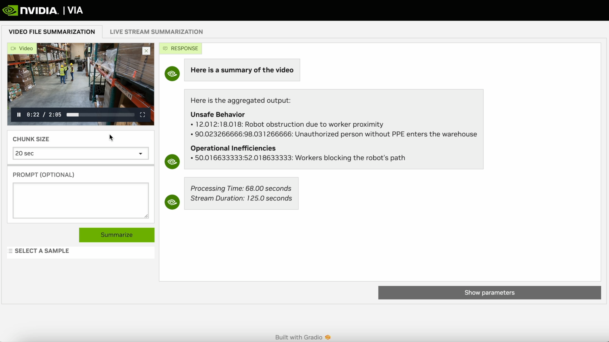

# VIA Summarization Workflow

VIA Microservice 2.0 DP allows users to summarize a long video. This can be quickly adopted for any use-case by updating a few parameters.




**Prompts**:
VIA is configured with three prompts:
1. Caption: This prompt is sent to the VLM to create dense captions for each video chunk.
2. Caption_summarization: This prompt is used by the CA-RAG's LLM to combine the dense captions in batches. An output summary will be created for each batch.
3. Summary_aggregation: This prompt is also used by the LLM to create the final summarized output from the output of previous LLM calls.

**Chunk Configurations**:
These depend on the use-case and dynamics of the video. Fast moving actions require smaller and overlapping chunks. Note that the chunk size can affect the end-to-end video processing time.
1. Chunk Duration
2. Chunk Overlap Duration (for Video Files)
3. Summary Duration (for Live Streams)

**Models**:
You can configure any compatible VLM and LLM based on your use-case. Fine-tuned models can be used to enable specific cases.


## Getting Started

Clone the repository, and go to the summarization_examples directory

```
git clone https://github.com/NVIDIA/metropolis-nim-workflows
cd metropolis-nim-workflows/via_workflows/summarization_examples
```

## Examples

### VIA with GPT-4o (VLM) and LLaMA 3 70b NIM (LLM)

Update the following keys in ```run_via_gpt4o.sh```

```
export NVIDIA_API_KEY=<NVIDIA_API-KEY>
export OPENAI_API_KEY=<YOUR-OPENAI-KEY>
```

Select a use-case you want to try out. You can select one from the provided options. Now, run the VIA server using the start script and provide the path to the config file.

```
bash run_via_gpt4o.sh $(pwd)/warehouse/default_config.yaml
```


### VIA with NVIDIA VITA 2.0 (Locally running VLM) and LLaMA 3 70b (LLM NIM)

Update the following keys in ```run_via_vita2.sh```

```
export NVIDIA_API_KEY=<NVIDIA_API-KEY>
export NGC_API_KEY=<YOUR-NGC-API-KEY>
```

Select a use-case you want to try out. You can select one from the provided options. Now, run the VIA server using the start script and provide the path to the config file.

```
bash run_via_vita2.sh $(pwd)/warehouse/default_config.yaml
```

## Accessing Chat UI

The following logs are seen after the microservice starts:

```
***********************************************************
VIA Server loaded
Backend is running at http://0.0.0.0:8000
Frontend is running at http://0.0.0.0:9000
Press ctrl+C to stop
***********************************************************
```

After the microservice starts, the VIA API is available at http://<HOST_IP>:8000 and the Demo UI
is available at http://<HOST_IP>:9000.