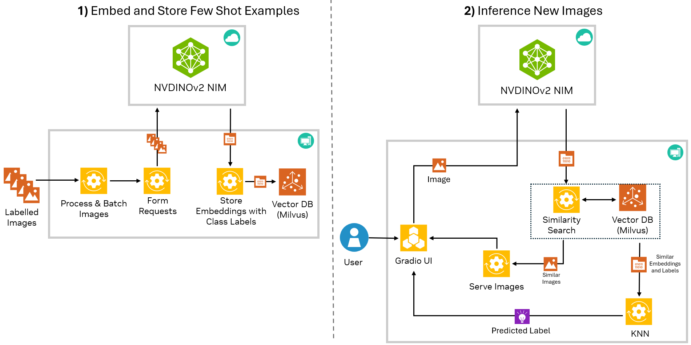
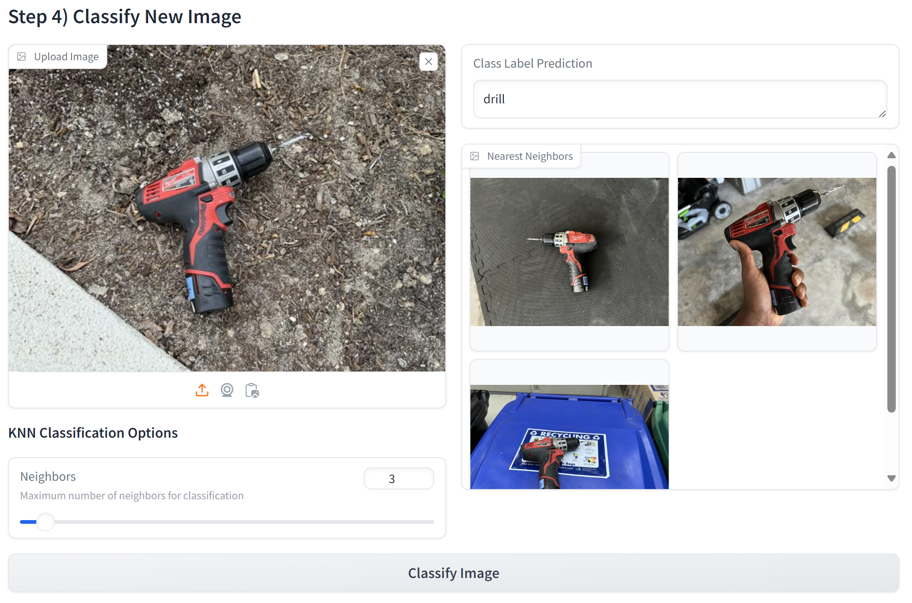

# NVDINOv2 Few Shot Classification with NIMs 


## Introduction

This example shows how to use the NVIDNOv2 NIM to and combine it with a vector database for few shot classification. 

The NVDINOv2 model is a general purpose vision embedding model. By using the NVDINOv2 NIM API, you can quickly generate embeddings on a set of images. These embeddings can stored in a vector database, clustered and searched to build a few shot classification pipeline with no model training or local GPU required. A Jupyter notebook is provided to walk through how to build this pipeline and a Gradio demo can be launched to quickly experiement with few shot classification.




## Setup

**Note**: The notebook and demo for this example will not run directly on Windows due to [lack of Windows support with Milvus-Lite](https://github.com/milvus-io/milvus/issues/34854). If you are on Windows, please use WSL to run the notebook and demo. Mac and Linux are supported. 


### Clone repository
```
git clone https://github.com/NVIDIA/metropolis-nim-workflows
cd metropolis-nim-workflows/workflows/nvdinov2_few_shot
```

### Make and activate virtual environment (Optional)

It is recommened to setup a virtual environment to install the Python dependencies. For more resources on creating a virtual enviroment refer to the [Python documentation](https://docs.python.org/3/tutorial/venv.html). 

```
python3 -m venv venv 
source venv/bin/activate
```

Install dependencies
```
python3 -m pip install -r requirements.txt
```

## Workshop Notebook (Optional) 

If you would like to go through a tutorial of how to use NVDINOv2, then you can launch the workshop notebook. This will walk you through how to generate embeddings with NVDINOv2 and build a few shot classification pipeline with a vector database. Otherwise, you can directly run the few shot classification demo in the next section. 

Launch jupyter notebook
```
python3 -m notebook 
```

This will launch the jupyter notebook web interface. You can navigate to the ```nvdinov2_nim_workshop.ipynb``` notebook in this repository to go through the tutorial. 


## Few Shot Classification Demo
The few shot classification demo is a Gradio UI that allows the user to build a few shot classification model with no training required! From the Gradio UI, the user can specify their classes, upload a handfull of example images and classify new images. 



To launch the few shot classification demo, you can run the main.py script directly and provide the necessary arguments: 

```
usage: main.py [-h] [--gradio_port GRADIO_PORT] api_key {nvclip,nvdinov2}

NVDINOv2 Few Shot Classification

positional arguments:
  api_key               NVIDIA NIM API Key
  {nvclip,nvdinov2}     Embedding model to use for few shot classification.

options:
  -h, --help            show this help message and exit
  --gradio_port GRADIO_PORT
                        Port to run Gradio UI
```

Example Usage:

```
python3 main.py nvapi-*** nvdinov2
```

The demo can also run with NVCLIP as the embedding generator:
```
python3 main.py nvapi-*** nvclip
```

The only required arguments are your NIM API key and model selection. Once the script is launched, the Gradio UI will become available at ```http://localhost:7860```. Note that when using NVDINOv2, each sample image added and inferenced will use 1 NIM API credit.


