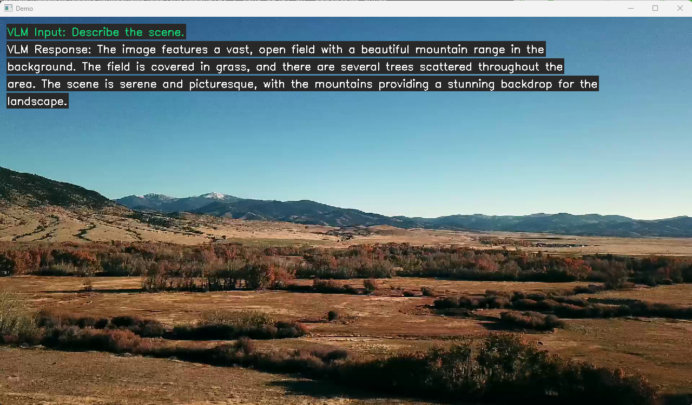
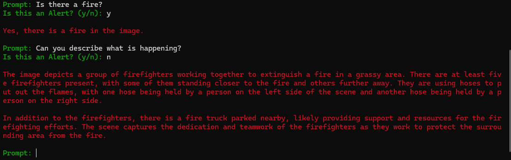

# VLM Video Alerts with NIMs

## Introduction

This example shows how to use a Visual Language Model NIM combined with streaming video to build an application that allows you to chat with a video and set looping prompts for alert use cases. 

For example, we can set the VLM NIM to monitor video input of drone footage that contains sections of a wildfire. We can then set a prompt asking the VLM "Is there a fire?" and use a VLM NIM to continously evaluate the alert on the video input. The VLM can then tell us when it detects a fire. This detection could then be connected with another script to take some action such as sending a notification. This example could be extended to build a more complex VLM agent capable of detecting many alerts across several live video streams using NIMs. 


## Setup 
Clone repo 
```
git clone https://github.com/NVIDIA/metropolis-nim-workflows
cd metropolis-nim-workflows/workflows/vlm_alerts
```

Make virtual environment (optional)
```
python3 -m venv venv 
source venv/bin/activate
```

Install dependencies
```
python3 -m pip install -r requirements.txt
```

## Tutorial Notebook (Optional) 

If you would like to go through a tutorial of how to use VLM NIMs, then you can launch the workshop notebook. Otherwise, you can directly run the streaming pipeline shown in the next section. 

Launch notebook
```
python3 -m notebook 
```

This will launch the jupyter notebook web interface. You can navigate to the ```nim_vlm_tutorial.ipynb``` notebook in this repository to go through the tutorial. 


## Streaming Pipeline
To launch the streaming pipeline on its own (without the notebook), you can run the main.py directly and provide the necessary arguments:

```
usage: main.py [-h] --model_url MODEL_URL --video_file VIDEO_FILE --api_key API_KEY [--port PORT] [--overlay] [--loop_video] [--hide_query]

Process a model and a video file.

options:
  -h, --help            show this help message and exit
  --model_url MODEL_URL
                        The invocation URL of the VLM NIM model
  --video_file VIDEO_FILE
                        The path to the video file
  --api_key API_KEY     API Key
  --port PORT           Flask Port
  --overlay             Enable VLM overlay
  --loop_video          Continuosly loop the video
  --hide_query          Only show alerts on the stream display.
```

For example 

```
python3 main.py --model https://build.nvidia.com/liuhaotian/llava16-34b --video_file test_video.mp4 --api_key "nvapi-123" --overlay --loop_video
```




All VLM nims are supported. The following list can be used in the --model_url argument of main.py 

- https://ai.api.nvidia.com/v1/vlm/community/llava16-34b
- https://ai.api.nvidia.com/v1/vlm/community/llava16-mistral-7b
- https://ai.api.nvidia.com/v1/vlm/nvidia/neva-22b
- https://ai.api.nvidia.com/v1/vlm/microsoft/kosmos-2
- https://ai.api.nvidia.com/v1/vlm/adept/fuyu-8b
- https://ai.api.nvidia.com/v1/vlm/google/paligemma
- https://ai.api.nvidia.com/v1/vlm/microsoft/phi-3-vision-128k-instruct


Your api key should come from [build.nvidia.com](http://build.nvidia.com) 

Once it is launched, you should see a window pop up with the video playing and the REST API endpoint should be live to send prompt updates.

### RTSP Input (Experimental)

The --video_file is passed to the [OpenCV VideoCapture function](https://docs.opencv.org/4.x/d8/dfe/classcv_1_1VideoCapture.html) which supports both video files and RTSP streams. This means you can directly pass an RTSP stream link to the --video_file argument. For example:

```
python3 main.py --model https://build.nvidia.com/liuhaotian/llava16-34b --video_file "rtsp://0.0.0.0:8554/stream" --api_key "nvapi-123" --overlay --loop_video
```

The pipeline will then pull the frames from the RTSP stream to use as input. Support for RTSP streaming depends on your OS and installed media backends supported by OpenCV such as FFMPEG and GStreamer. If you have issues with RTSP streaming, please refer to the [OpenCV documentation](https://docs.opencv.org/4.x/d8/dfe/classcv_1_1VideoCapture.html#a31e7cf5ba9debaec15437a200b18241e). 

## Streaming Pipeline Client
The streaming pipeline can be interacted with through the query REST API endpoint as shown in the jupyter notebook with these Python code snippets.  

```
#send query 
prompt = "Can you describe the scene?"
params = {"query":prompt, "alert":False}
url = f"http://localhost:{port}/query"
response = requests.get(url, params=params)
print(response)
print(response.text)
```

```
#send alert. This will be evaluated continuously.  
prompt = "Is there a fire? Answer yes or no."
params = {"query":prompt, "alert":True} #set alert to True to enable continuous evaluation
url = f"http://localhost:{port}/query"
response = requests.get(url, params=params)
print(response)
print(response.text)
```

You can call this endpoint from the jupyter notebook cells or by running one of the client programs 

- client_cli.py
- client_gradio.py  

```
python3 client_gradio.py
```


```
python3 client_cli.py
```



Both client programs will allow you to send queries and alerts to the running streaming pipeline. 


